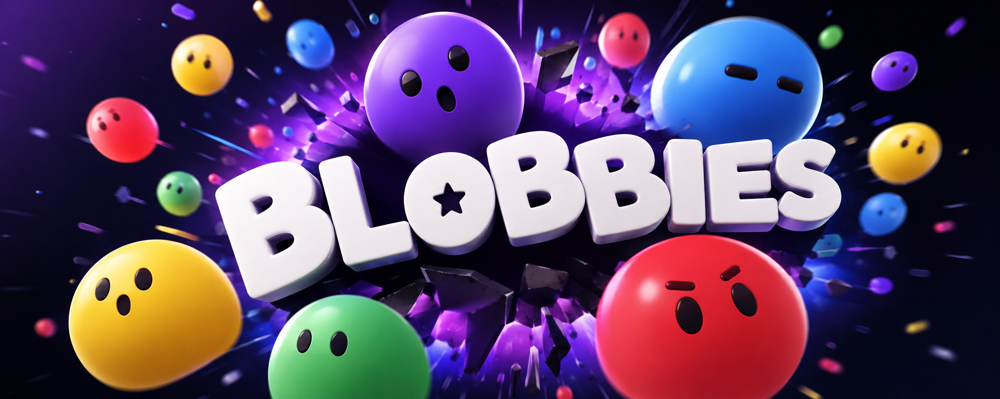

# 🫧 Blobbies

<p align="center">
  
</p>

<p align="center">
  <strong>Your own team of AI helpers. Living on your computer.</strong>
</p>

<p align="center">
  <a href="https://github.com/KenKaiii/blobbies/releases/latest"></a>
  <a href="LICENSE"></a>
  <a href="https://github.com/KenKaiii/blobbies"></a>
  <a href="https://youtube.com/@kenkaidoesai"></a>
  <a href="https://skool.com/kenkai"></a>
</p>

<p align="center">
  macOS · Windows · Linux. Installers on the <a href="https://github.com/KenKaiii/blobbies/releases/latest">release page</a>; the app updates itself afterwards.
</p>

---

Little AI teammates called **Blobs**. Make one, name it, give it a job. One for email, one for research, one that hypes you up before meetings.

They remember you. They work in your apps. And **your data never touches an AI company.**

---

## ✨ What Blobs do

- **Remember you.** Per-Blob memories plus team-wide facts. Every entry viewable, editable, deletable.
- **Do stuff in your apps.** Gmail, Calendar, Slack, Notion, Spotify. 942 apps in the catalog, through your own Composio account.
- **Work while you're away.** Routines every N minutes, daily, weekly, or once. Desktop notification when done.
- **Team up.** Up to 6 Blobs per group chat. @mention one, or ask the room and let them sort it out.
- **Make more Blobs.** A Blob can spawn, edit, message and retire other Blobs.
- **Read your files.** PDFs, screenshots, photos. Text extraction and OCR run on your machine, in Rust, never uploaded.
- **Search and read the web.** DuckDuckGo Lite, falling back to Bing. No setup.
- **Run local commands.** Allowlisted programs only, argv never a shell string, sandboxed to that Blob's folder.
- **Learn skills and MCP servers.** Drop a folder in `~/.blobbies/skills/`, or connect loopback MCP servers for more tools.

---

## 🚨 The mistake everyone is making

Everyone is plugging Gmail, Drive and Slack into AI agents. Nobody asks the one question that matters:

> Your agent reads your email. **Where does that email go?**

To an AI provider. Not a summary, the actual words, in plaintext, on their servers. That is the only way a model reads anything.

Code is a different bet: a repo is bounded and replaceable. Your inbox holds every password reset link, contract and medical result you own. People hand over that master key in one OAuth click, for a to-do list summary.

### "But it has zero data retention"

ZDR describes what happens **after** they get your email. They still got it.

- **Decrypted on their machines.** Not stored never meant not read.
- **Usually logged first.** OpenAI keeps abuse logs on all API usage for 30 days; opting out needs their approval. ([docs](https://developers.openai.com/api/docs/guides/your-data))
- **A judge can undo it.** In the NYT case a court made OpenAI preserve logs it would have deleted, including chats users deleted themselves. True ZDR endpoints were exempt, because there was nothing to preserve.
- **A policy update can kill it.** On 9 June 2026 Anthropic started keeping 30 days on covered models, including orgs that had ZDR on. ([notice](https://support.claude.com/en/articles/15425996-data-retention-practices-for-covered-models))

**ZDR is a receipt, not a lock.** Data they never received cannot be logged, subpoenaed or breached.

---

## ✅ The two ways out

Two model paths. Everything else is refused at the build level.

| | **Local (Ollama)** | **Tinfoil** |
| --- | --- | --- |
| Where it runs | Your CPU/GPU | Cloud, inside a hardware enclave |
| Cost | **Free** | Your own key, usage-based |
| Works offline | Yes | No |
| Brains | Capped by your hardware | Frontier open-weight models |
| Who can read your prompt | You | Nobody. **Verified, not promised** |

### Why Tinfoil

Everyone else offers a **promise**: a policy page, a retention toggle, a "we don't train on API data" line. You cannot check any of it from outside. Tinfoil swaps that for a check your machine runs before every connection:

1. **Hardware enclave.** The model sits in AMD SEV-SNP confidential compute. The CPU encrypts memory itself, so the host operator, Tinfoil included, sees ciphertext where your prompt should be. They cannot read it even if a court tells them to.
2. **Attested before a byte leaves you.** Your machine checks the enclave's attestation against the published open-source build, logged in Sigstore. Mismatch means **the request never sends.**
3. **Encrypted to the enclave**, not to a company: HPKE on your device, opened only inside.
4. **Your key, your bill.** No backend, no account, no server of ours to breach.

**Subpoena Tinfoil, you get ciphertext. Subpoena a normal provider, you get your inbox.**

**Honest bit:** you are trusting AMD's root of trust, and attestation proves the *published* code ran, not that it is harmless. Far smaller than a policy page. Not zero. Check it: [verification docs](https://docs.tinfoil.sh/verification/verification-in-tinfoil), [the SDK that attests](https://github.com/tinfoilsh/tinfoil-js), [the protocol](https://github.com/tinfoilsh/encrypted-http-body-protocol).

**Not a policy, the build.** The Anthropic SDK is stubbed out (`src/lib/anthropic-stub.ts`) and the webview's `connect-src` allows four origins and no others: `*.tinfoil.sh`, Sigstore's CDN, and Ollama on localhost. Adding a provider means editing `tauri.conf.json`, in public, in a fork.

---

## 💸 What it costs, and which brain to use

| | Monthly |
| --- | --- |
| **Blobbies + local model** | **$0.** Forever. |
| **Blobbies + Tinfoil** | Roughly **$10 to $20**, on your own key |
| Grok Bot (cheapest) | $120/seat Premium Teams |
| Grok Bot (solo) | $200 Cursor Ultra, or $300 SuperGrok Heavy |

Tinfoil is that cheap because of the next bit. Biggest myth going: you need the smartest model on earth to read your email. You don't. Sorting an inbox is not a maths olympiad.

| The job | The brain |
| --- | --- |
| Email, calendar, Slack, notes | A local model, or a small Tinfoil one |
| Research, long docs, proper writing | Mid-size Tinfoil model |
| Coding agent running all night | Go big. That is not this app |

Tinfoil serves **DeepSeek V4 Flash**, **Kimi K3**, **GLM 5.2**, **gpt-oss-120b**. Any of them handle "check my calendar, flag anything urgent, draft a reply" without breaking a sweat.

Point a frontier model at labelling emails and you are renting a Ferrari for the school run. Works fine. Still daft. Your credit burns in a week.

Free and private are not supposed to be a trade. Here they are the same choice.

---

## ⚔️ Blobbies vs Grok Bot

xAI's take on AI teammates, in beta since 11 Aug 2026 and genuinely capable. Also the clearest example of the trade this README is about: your tools, logins and data live on their machine by design.

|  | 🫧 **Blobbies** | **Grok Bot** |
| --- | --- | --- |
| **Source code** | Open, AGPL-3.0. Verify these claims yourself | Closed |
| **Price** | Free, or your own Tinfoil key | $120–$300/mo, plus metered usage |
| **Where your data sits** | `~/.blobbies` on your disk | xAI's cloud. Required, not a setting |
| **Private by default** | Yes, architecturally: no server to send it to | No. Privacy Mode (Legacy) blocks the product |
| **The AI** | Local, or open models in attested enclaves | Grok only, no model picker |
| **Works offline** | Yes, with a local model | No |
| **Always on** | Your machine. Cloud runners on the roadmap | Yes, their cloud VM |
| **Platforms** | macOS, Windows, Linux | macOS, Windows, iOS. No Linux |

Facts from [x.ai/bot](https://x.ai/bot) and xAI's docs, checked 22 Aug 2026. It's a beta; expect change.

**Fair is fair.** Grok Bots have a cloud computer, so they keep working with your laptop shut. Blobbies runs on your machine, so routines fire while it is on.

That is a starting point, not a wall. Cloud runners are on the roadmap, and scheduling is the easy half to add later. The hard half is the one built first: no server of ours holds your data.

---

## 📍 Where your data goes

| Data | Where it goes |
| --- | --- |
| Chats, memories, Blobs, files | `~/.blobbies` on your disk. Nothing else. |
| API keys | OS keychain, never a plain file |
| Prompts, local model | Nowhere. Your machine. |
| Prompts, Tinfoil | Encrypted to an attested enclave, using your key |
| Plugin actions | Composio's cloud, on your own account. See below. |
| Web search | DuckDuckGo Lite, then Bing if blocked |
| Update checks | Version → GitHub Releases, minisign-signed |
| Telemetry, analytics, crash reports | **None.** Nothing to opt out of. |

**One honest caveat.** Plugin calls route through Composio's cloud, on your own account. That is a **transit** hop, not a model host: the email body lands on your disk and is read by your local model or your enclave, never by an AI provider.

Want zero third parties? Skip plugins. Files, web search and local commands still work.

---

## 🚀 Get it

Grab it from the [latest release](https://github.com/KenKaiii/blobbies/releases/latest): macOS (Apple Silicon + Intel `.dmg`), Windows (`.exe`), Linux x86_64 (`.deb` + AppImage). It updates itself after that. Windows builds are unsigned, so SmartScreen will grumble at you.

Then pick a brain in **Settings → Model**: install [Ollama](https://ollama.com) for free and offline, or paste a [Tinfoil key](https://tinfoil.sh) for a bigger one. Keys go to your OS keychain, not a file.

---

## 👥 Come hang out

- [YouTube @kenkaidoesai](https://youtube.com/@kenkaidoesai), tutorials and demos
- [Skool community](https://skool.com/kenkai)

---

## 👨‍💻 For devs

**Requirements:** Node ≥ 22.12, pnpm 10 (`corepack enable`), Rust 1.90 (auto-installed), plus [Tauri platform deps](https://tauri.app/start/prerequisites/):

- **macOS**: `xcode-select --install`
- **Linux** (Debian/Ubuntu): `sudo apt install libwebkit2gtk-4.1-dev libappindicator3-dev librsvg2-dev patchelf`, plus a Secret Service provider (`gnome-keyring`, KWallet). Without one, saving a key fails with a D-Bus error.
- **Windows**: VS 2022 Build Tools, **Desktop development with C++** workload.

```bash
git clone https://github.com/KenKaiii/blobbies.git
cd blobbies
pnpm install
cp .env.example .env.local   # optional: add a TINFOIL_API_KEY for dev
pnpm tauri:dev   # loads .env.local on every OS
```

```bash
pnpm tauri:build   # production bundle (dmg / deb+AppImage / NSIS exe)
pnpm check         # everything CI runs: lint, types, tests, clippy
```

CI builds and tests on macOS, Windows and Linux every push, and a [release workflow](.github/workflows/release.yml) ships installers for each.

---

## 📄 Licence and trademarks

AGPL-3.0. Use it, change it, run it for yourself. Run a modified version as a service for others, and share your changes. Third-party notices: [THIRD-PARTY-NOTICES.md](THIRD-PARTY-NOTICES.md).

App logos in `public/logos` are trademarks of their owners, shown only to identify the matching integration. Blobbies isn't affiliated with any of them.

---

<p align="center">
  <strong>Your stuff stays yours. Your team does the rest.</strong>
</p>
